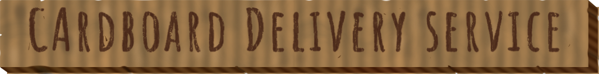
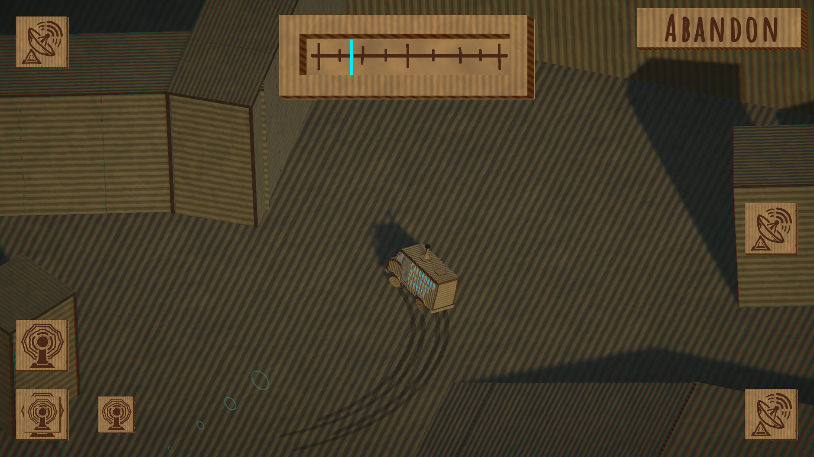
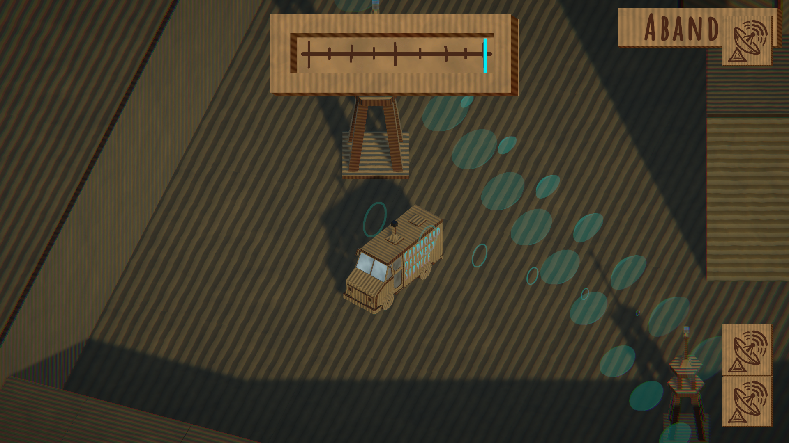

# Cardboard Delivery Service

A **Ludum Dare 59 COMPO** entry on the theme: **Signal**

Built in 48 hours, solo, with all assets created during the game jam

  

## Overview
Cardboard Delivery Service is a signal-routing game where the player connects network towers using a delivery van. Towers cannot form connections directly — signal propagation is routed through hub towers while avoiding obstacles that block line-of-sight communication.

## Controls
- WASD — Move
- E — Connect / Disconnect van
- R — Shutdown tower (stop receiving signal)

## Tools
- Unity
- Blender
- Photoshop
- Audacity

## Credits

All models, textures, and sound effects were created by me

The soundtrack was created with the help of AI

## Showcase

